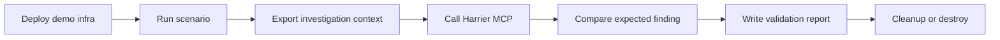

<h1 align="center">
  <br>
  
  <br>
</h1>

<p align="center">
  <strong>Disposable AWS scenarios for validating Harrier EMR MCP against real EMR failures.</strong>
</p>

<p align="center">
  <a href="LICENSE"></a>
  <a href=".github/workflows/ci.yml"></a>
  <a href="docs/cost-and-retention.md"></a>
  <a href="docs/scenarios.md"></a>
</p>

<p align="center">
  <a href="#safety-first">Safety First</a> |
  <a href="#quick-start">Quick Start</a> |
  <a href="#scenario-catalog">Scenarios</a> |
  <a href="#validation-flow">Validation</a> |
  <a href="#documentation">Docs</a>
</p>

---

Harrier EMR Demo Lab creates controlled Amazon EMR incidents and validates that Harrier EMR MCP can diagnose them. It owns the disposable AWS infrastructure, Spark jobs, sample data, scenario runners, expected findings, validation harness, alarms, cleanup, and cost-control docs.

The production MCP server lives in [`harrier-emr-mcp`](../harrier-emr-mcp).

## Safety First

This repository can create real AWS resources and real AWS cost. Use a sandbox account.

- Review [docs/cost-and-retention.md](docs/cost-and-retention.md) before deploying.
- Review [docs/cleanup.md](docs/cleanup.md) before running long scenario batches.
- Keep `.harrier-demo/`, Terraform state, generated data, and credentials out of git.
- Destroy resources when validation is complete.

## Quick Start

Deploy baseline infrastructure:

```bash
make deploy
```

Run a single EMR on EC2 scenario:

```bash
SCENARIO=s3_access_denied RUNTIME=emr_ec2 make run-scenario
```

Validate the scenario through a running Harrier MCP endpoint:

```bash
AWS_ACCOUNT_ID=123456789012 \
HARRIER_MCP_URL=https://example.execute-api.region.amazonaws.com/mcp \
SCENARIO=s3_access_denied RUNTIME=emr_ec2 make validate
```

Destroy the lab:

```bash
make destroy
```

## Runtime Support

| Runtime | Supported Scenarios | Notes |
| --- | ---:| --- |
| EMR on EC2 | broad coverage | Spark step failures, YARN/container logs, CloudWatch metrics |
| EMR Serverless | focused coverage | Spark job-run failures with S3 and CloudWatch logs |
| EMR on EKS | focused coverage | EMR Containers job runs with optional Kubernetes pod diagnostics |
| MWAA local runner | orchestration demo | Runs scenario DAGs on ECS Fargate |

## Scenario Catalog

| Scenario | Runtime Coverage | Expected Finding |
| --- | --- | --- |
| `happy_path` | EC2, Serverless, EKS | success |
| `s3_access_denied` | EC2, EKS | `S3_ACCESS_DENIED` |
| `bad_input_data` | EC2, Serverless | `BAD_INPUT_DATA` |
| `executor_oom` | EC2, Serverless, EKS | `EXECUTOR_OOM` |
| `driver_oom` | EC2 | `DRIVER_OOM` |
| `missing_dependency` | EC2, Serverless | `DEPENDENCY_MISSING` |
| `s3_path_missing` | EC2, Serverless | `S3_PATH_MISSING` |
| `shuffle_spill` | EC2 | `SHUFFLE_SPILL` |
| `data_skew` | EC2 | `DATA_SKEW` |
| `kms_access_denied` | EC2 | `KMS_ACCESS_DENIED` |
| `hdfs_full` | EC2 | `HDFS_FULL` |
| `db_connection_failure` | EC2 | `DB_CONNECTION_FAILURE` |
| `db_lock_timeout` | EC2 | `DB_LOCK_TIMEOUT` |
| `db_partition_hotspot` | EC2 | `DB_PARTITION_HOTSPOT` |
| `db_large_join_spill` | EC2 | `DB_LARGE_JOIN_SPILL` |
| `db_bad_sql_plan` | EC2 | `DB_BAD_SQL_PLAN` |
| `livy_session_failure` | EC2 | `LIVY_SESSION_FAILURE` |
| `image_pull_failure` | EKS | `EKS_IMAGE_PULL_FAILURE` |
| `pod_pending_resource_pressure` | EKS | `EKS_POD_PENDING` |

Full details are in [docs/scenarios.md](docs/scenarios.md) and [docs/validation-matrix.md](docs/validation-matrix.md).

## Run Serverless Scenarios

```bash
RUNTIME=emr_serverless ./scripts/run_scenario.sh executor_oom
RUNTIME=emr_serverless ./scripts/run_scenario.sh bad_input_data
```

Validate through Harrier:

```bash
AWS_ACCOUNT_ID=123456789012 \
RUNTIME=emr_serverless \
HARRIER_MCP_URL=https://example.execute-api.region.amazonaws.com/mcp \
./scripts/validate_scenario.sh executor_oom
```

## Run EMR On EKS Scenarios

Prepare the EKS virtual cluster:

```bash
EMR_EKS_CLUSTER_NAME=analytics-dev \
EMR_EKS_JOB_ROLE_ARN=arn:aws:iam::123456789012:role/harrier-demo-emr-eks-job \
./scripts/setup_eks_virtual_cluster.sh
```

Run and validate:

```bash
RUNTIME=emr_eks ./scripts/run_scenario.sh image_pull_failure

AWS_ACCOUNT_ID=123456789012 \
RUNTIME=emr_eks \
HARRIER_MCP_URL=https://example.execute-api.region.amazonaws.com/mcp \
./scripts/validate_scenario.sh image_pull_failure
```

See [docs/emr-on-eks-prerequisites.md](docs/emr-on-eks-prerequisites.md).

## Validation Flow



Validation reports are written under `.harrier-demo/validation/` and should not be committed.

## MWAA Local Runner

The demo lab can package the scenario runner into an AWS MWAA-compatible local runner on ECS Fargate.

```bash
./scripts/deploy_mwaa_local_runner.sh
```

See [docs/mwaa-local-runner.md](docs/mwaa-local-runner.md).

## Documentation

- [Demo overview](docs/demo-overview.md)
- [Scenario catalog](docs/scenarios.md)
- [Expected findings](docs/expected-findings.md)
- [Validation matrix](docs/validation-matrix.md)
- [Cost and retention](docs/cost-and-retention.md)
- [Cleanup](docs/cleanup.md)
- [DevOps Agent demo flow](docs/devops-agent-demo-flow.md)
- [EMR on EKS prerequisites](docs/emr-on-eks-prerequisites.md)
- [Local developer experience](docs/local-developer-experience.md)
- [CI and release](docs/ci-and-release.md)
- [Roadmap](ROADMAP.md)
- [Support](SUPPORT.md)
- [Maintainers](MAINTAINERS.md)
- [Architecture decisions](docs/adr/README.md)
- [Social preview assets](docs/social-assets.md)
- [GitHub labels](docs/labels.md)
- [Examples](examples/README.md)
- [DevOps Agent prompts](examples/devops-agent-prompts.md)

## Contributing

Contributions should improve safety, repeatability, clarity, or coverage. See [CONTRIBUTING.md](CONTRIBUTING.md).

## License

Apache-2.0. See [LICENSE](LICENSE).
